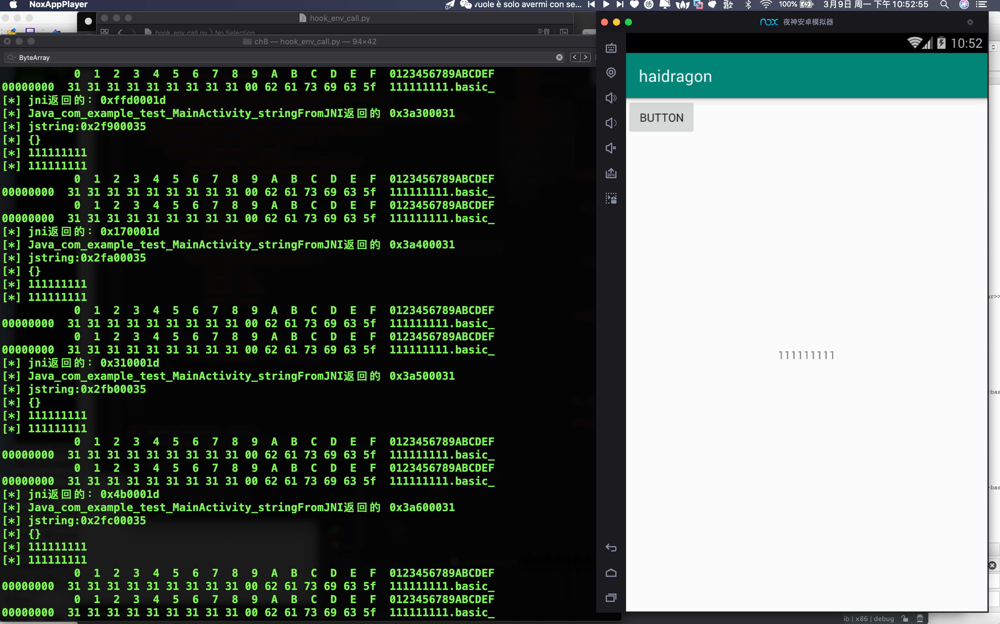

#  第八课
* 第八课 c/c++ so高级部分下 JNIEnv函数hook、主动调用JNIEnv函数、JNIEnv_trace实现)
```
export PATH=$PATH:/Users/haidragon/Library/Android/sdk/platform-tools 
import ssl
ssl._create_default_https_context = ssl._create_unverified_context
```



