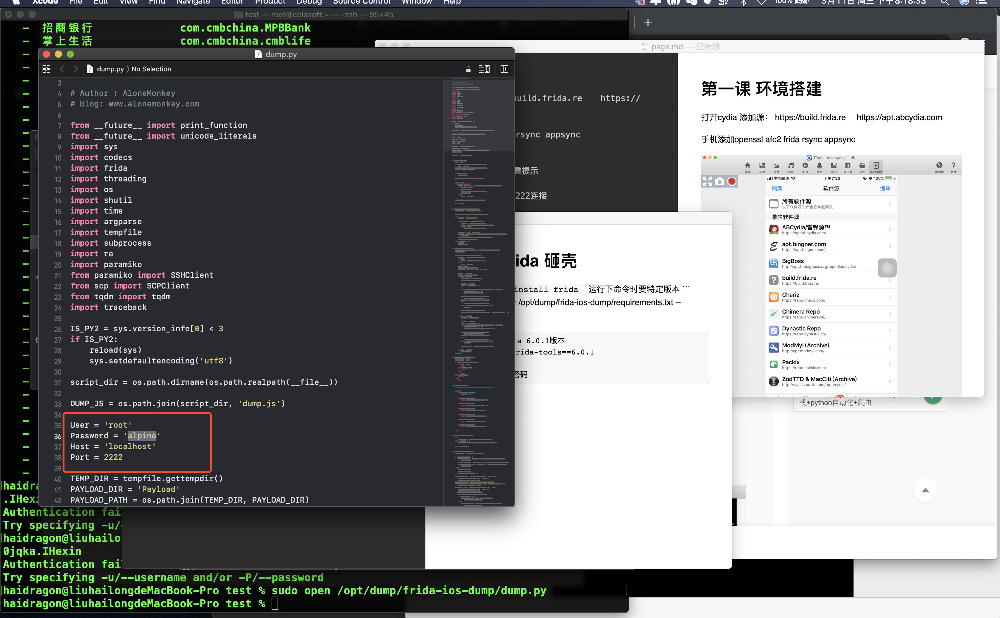
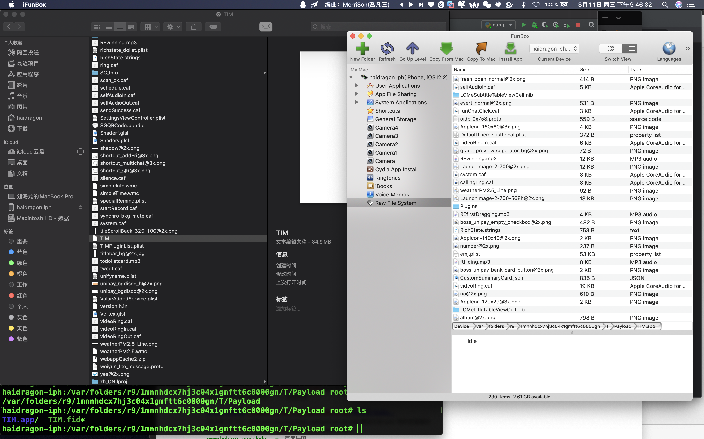

# 第一课 frida 砸壳
安装frida
```
pip3 install frida 
```
运行下命令时要特定版本

```
sudo pip3 install -r /opt/dump/frida-ios-dump/requirements.txt --upgrade

```
安装frida-tools 6.0.1版本 
pip install frida-tools==6.0.1

修改dump端口与密码

解锁手机开始砸壳



